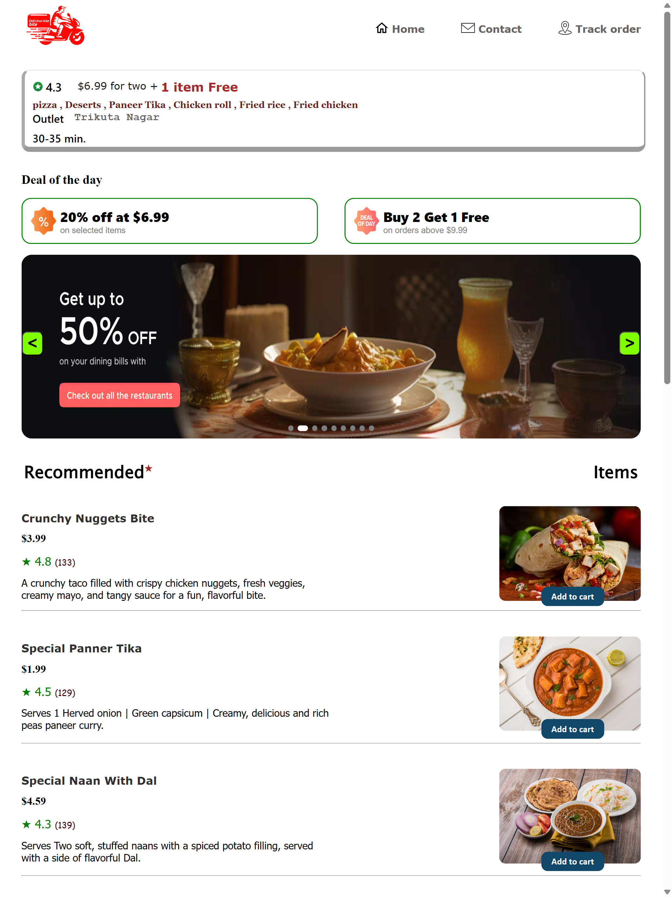
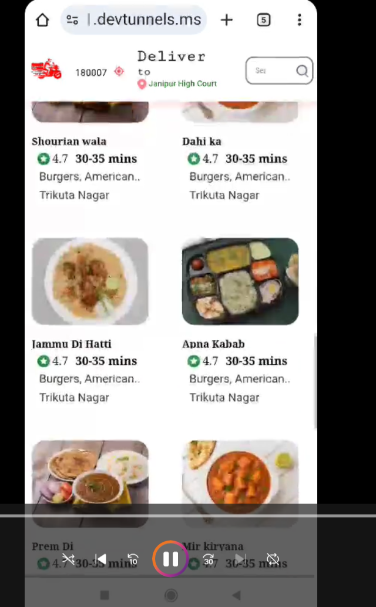
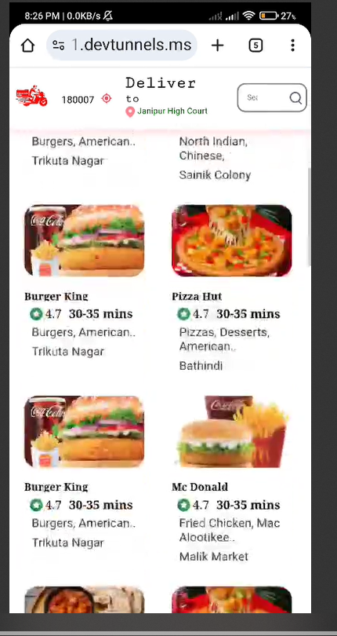

# 🍽️ Food Ordering Platform

Welcome to the Food Ordering Platform! This is a modern, responsive web application for browsing, ordering, and tracking food from various restaurants. Built with pure HTML, CSS, and JavaScript, it provides a seamless user experience for food lovers.

---

## 🚀 Features

- **Browse Menu:** Explore a wide variety of cuisines and dishes with images and detailed descriptions.
- **Add to Cart:** Easily add items to your cart and manage your selections.
- **Checkout & Payment:** Secure and simple checkout process with wallet and payment options.
- **Order Tracking:** Track your order status in real-time.
- **Wallet Integration:** Manage your wallet and view transaction history.
- **Responsive Design:** Optimized for desktops, tablets, coming soon for mobile devices.

---

## 📁 Project Structure

```
food-ordering-platform/
│
├── index.html         # Home page
├── items.html         # Menu & items
├── checkout.html      # Cart & checkout
├── payment.html       # Payment page
├── track.html         # Order tracking
├── wallet.html        # Wallet management
├── css/               # Stylesheets
├── js/                # JavaScript files
├── images/            # Images & icons
│
├── README.md              # Project overview
└── ...
```

## 🛠️ Technologies Used

- **HTML5**
- **CSS3**
- **JavaScript (ES6)**

---

Welcome to the Food Ordering Platform, a modern and responsive web application built with pure HTML, CSS, and JavaScript. This platform offers a seamless experience for browsing, ordering, and tracking food from a variety of restaurants.

🚀 Features
Browse & Explore: Discover a wide range of cuisines and dishes with detailed descriptions and images.

Easy Cart Management: Add items to your cart and effortlessly manage your selections.

Secure Checkout: A simple and secure checkout process with integrated wallet and payment options.

Real-time Tracking: Keep an eye on your order's status with real-time tracking.

Wallet Integration: Manage your digital wallet and review your transaction history.

Responsive Design: Optimized for a great user experience on both desktops, tablets & Mobile.
<hr>

🛠️ Technologies Used
HTML5: For the core structure of the web pages.

CSS3: For all styling and layout.

JavaScript (ES6): For interactive features and dynamic content.
<hr>
📸 Preview
<br>

<div align="center" style="display: flex; justify-content: flex-start; flex-wrap: wrap; gap: 10px; max-width: 900px; padding: 10px; border: 1px solid #ddd; border-radius: 8px;">
<!--  --> 



</div>
---
                                                                                                                                                                       <br>
<hr>
## 📦 Getting Started

1. **Clone the repository:**
   ```powershell
   git clone https://github.com/codevory/food-ordering-platform.git
   ```
2. **Open the link in your browser:**
   - Start with `index.html` for the homepage.

---

## ✨ Contributing

Contributions are welcome! Feel free to fork the repo, submit pull requests, or suggest features.

---

## 📄 License

This project is licensed under the MIT License.

---

## 🙌 Credits

Developed by [codevory](https://github.com/codevory) and contributors.
